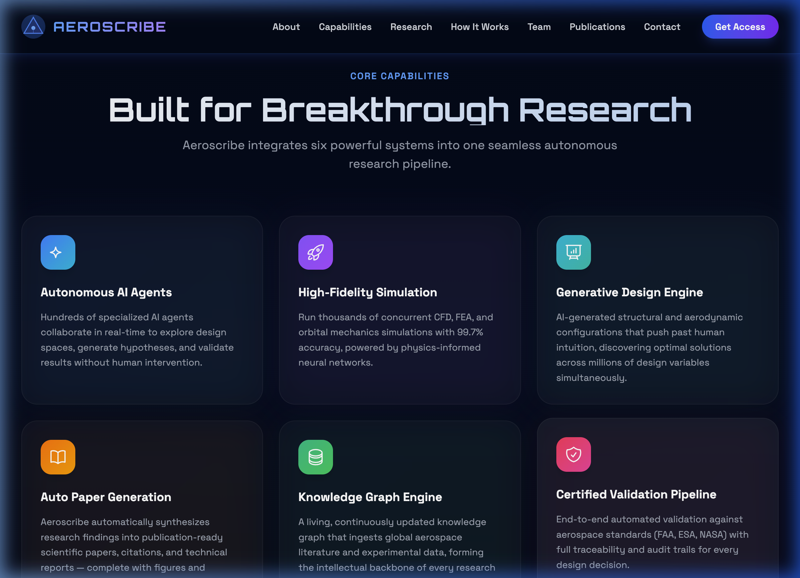

# ✈️ AeroScribe
### World's first autonomous Aerospace research laboratory

AeroScribe is an autonomous research engine designed to accelerate aerospace science. From literature archaeology and research gap detection to computational validation (CFD) and manuscript synthesis, AeroScribe handles the heavy lifting of scientific research.

---

## 🌐 Live Demo
**[View the Landing Page](https://knarayanareddy.github.io/Aeroscribe/)**

---

## 🎨 Professional Preview

---

## 🏗️ Project Structure
AeroScribe is built as a high-integrity monorepo following modern software engineering practices:

- **`apps/landing-page`**: React + Vite + TypeScript showcase of the platform.
- **`specs/`**: Detailed technical specifications for every stage of the autonomous pipeline.
- **`packages/`**: Core logic (planned) for literature archaeology, LaTeX rendering, and CFD integration.

## 🧬 Principles
1. **Zero Hallucination**: No fabricated numbers. Ever.
2. **Verified Registry**: SHA256 checksums for all computational evidence.
3. **Journal Calibration**: Automated formatting for AIAA, Elsevier, and Acta Astronautica.
4. **Human-in-the-Loop**: Strategic decision gates for the researcher.

## 🚀 Getting Started
Check out [completespecarchitecture.md](./completespecarchitecture.md) for the full technical roadmap.

---
*Generated by AeroScribe AI*
